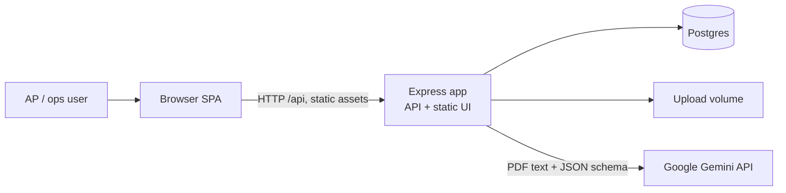
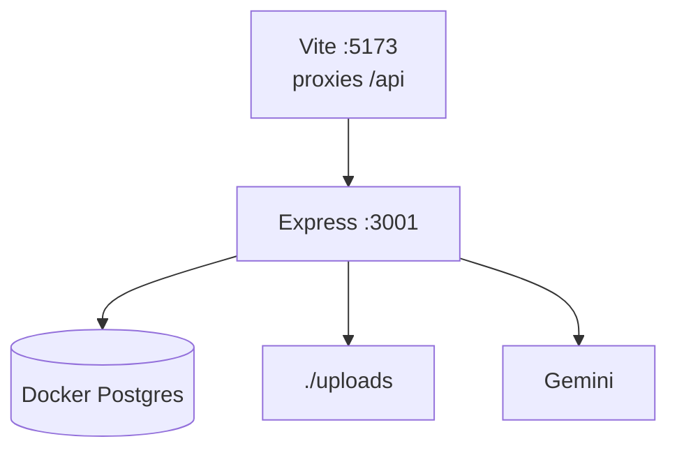
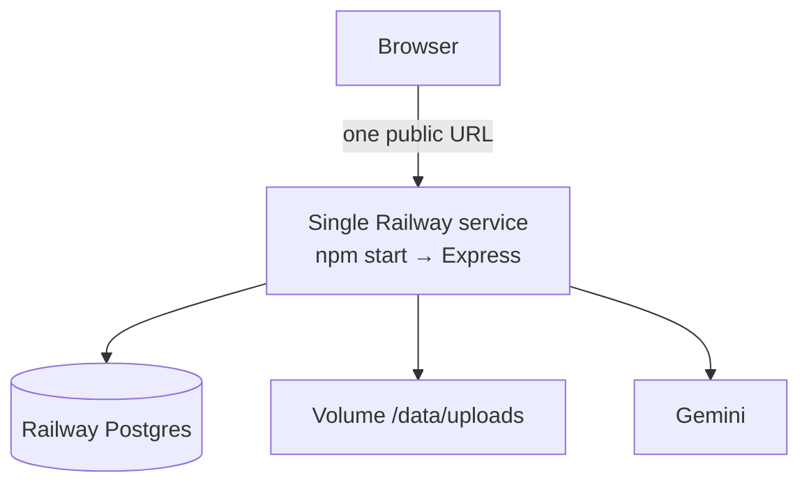
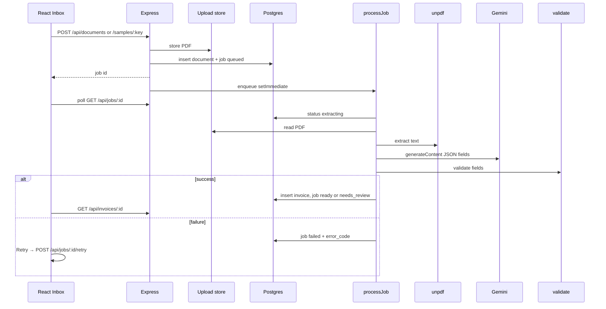

# Ledger Parse - architecture design

## 1. Purpose

Ledger Parse turns messy vendor invoice PDFs into structured, reviewable data.

The hard problem is not “call an LLM.” Extraction is often wrong. The product therefore:

1. Extracts with Gemini into a **fixed field schema**
2. Runs a **deterministic validator** (totals, date, currency, invoice #)
3. Shows confidence and issues on a **Review** screen
4. Treats the **user’s edit as source of truth**

Not in scope: auth, chat/RAG, OCR-as-main-path, search filters, multi-tenant, or a regex/template field parser.

---

## 2. System context

One process serves both UI and API in production. Gemini never sees the PDF bytes - only extracted text (capped).

---

## 3. Repository shape

npm workspaces monorepo:

| Path | Role |
| --- | --- |
| `frontend/` | Vite + React + TypeScript SPA |
| `backend/` | Express (JS) API, job processor, static host |
| `sample-docs/` | Built-in demo PDFs |
| `.github/workflows/` | FE/BE lint and test Actions |
| `decisions.md` | Running product/stack decisions |
| `ERD.md` | Data model diagram |

---

## 4. Runtime architecture

### Local development

- `npm run dev:all` starts Compose Postgres, then Vite + Express.
- Vite proxies `/api` and `/health` to the API so the browser stays same-origin.

### Production (Railway)

- Build: Nixpacks `npm ci --include=dev` then `npm run build` (Vite → `frontend/dist`)
- Start: `npm start` (Express serves `frontend/dist` + `/api` + `/health`)
- Config: `railway.json` (Nixpacks, healthcheck `/health`)

---

## 5. Request / extract pipeline

### Job states

`queued` → `extracting` → `needs_review` | `ready` | `failed`

Retries clear any prior invoice for that job and re-queue extraction.

### Extract details

1. **unpdf** - text only from digital PDFs (not OCR)
2. **Gemini** - fixed JSON shape (vendor, invoice #, date, currency, money fields, line items + confidence/snippets)
3. **Retries** - transient 503/429 with backoff; optional model fallback list
4. **Clip** - PDF text truncated (~8k chars) before the prompt
5. **Validator** - missing invoice #, bad date/currency, line-item sum vs total (`TOTAL_MISMATCH`)

User PATCH on `/api/invoices/:id` applies edits, re-validates, and marks fields `sourceOfTruth: user`.

---

## 6. API surface

| Method | Path | Purpose |
| --- | --- | --- |
| `GET` | `/health` | Liveness + DB ping |
| `POST` | `/api/documents` | Upload PDF (multipart) |
| `POST` | `/api/documents/samples/:key` | Start sample (`clean`, `mismatch`, `missing`, `euro`, `baddate`) |
| `GET` | `/api/documents/:id/file` | Serve stored PDF for Review iframe |
| `GET` | `/api/jobs/:id` | Poll job (+ `invoiceId` when done) |
| `POST` | `/api/jobs/:id/retry` | Re-run failed extraction |
| `GET` | `/api/invoices/:id` | Load invoice + `previewUrl` |
| `PATCH` | `/api/invoices/:id` | Save user field edits |
| `GET` | `/api/inbox?limit&offset` | Paginated recent invoices + failed jobs |

Jobs are processed **in-process** (`setImmediate`). No Redis/queue worker. Fine for a single-instance demo; not multi-replica safe.

---

## 7. Data model

Three tables. See [ERD.md](./ERD.md) for the diagram.

| Table | Responsibility |
| --- | --- |
| `documents` | File metadata + `storage_path`, `source` (`upload` \| `sample`) |
| `jobs` | Extract attempt lifecycle and failure codes |
| `invoices` | Validated `fields` + `issues` JSONB, status `needs_review` \| `ready` |

Cascade deletes: removing a document removes its jobs and invoices.

---

## 8. Frontend architecture

| Route | Screen | Role |
| --- | --- | --- |
| `/` | Inbox | Samples, upload, infinite-scroll Recent list |
| `/jobs/:jobId` | JobWait | Progress bar while polling; Retry on failure |
| `/invoices/:id` | Review | PDF preview + editable fields + Confirm & save |

Patterns:

- React Router SPA
- Shared `api.ts` fetch helpers
- Toasts for success/error
- Field/status chips for trust and review state
- TypeScript types mirror invoice/job shapes

---

## 9. Cross-cutting concerns

### Configuration

| Variable | Use |
| --- | --- |
| `DATABASE_URL` | Postgres (required) |
| `PORT` | Listen port (Railway injects) |
| `UPLOAD_DIR` | PDF storage (`./uploads` local, `/data/uploads` on Railway) |
| `GEMINI_API_KEY` | Server-only |
| `GEMINI_MODEL` | Default `gemini-3.8-flash` |
| `GEMINI_TIMEOUT_MS` / `GEMINI_RETRIES` / `GEMINI_MAX_CHARS` | Extract tuning |
| `MAX_UPLOAD_MB` | Upload size cap (default 10) |

### Failure modes

| Case | Behavior |
| --- | --- |
| Non-PDF / oversize | `400` with human message |
| Unreadable / empty PDF text | Job `failed` (`UNREADABLE` / `EMPTY_TEXT`) |
| Gemini 503 / 429 | Retry, then `MODEL_OVERLOADED` / `RATE_LIMIT` + Retry UI |
| Bad JSON / timeout / missing key | Mapped error codes, user can retry |
| Totals mismatch | Invoice `needs_review` + banner; user fixes total |

### Security (demo posture)

- No auth - anyone with the URL can upload
- API key never sent to the browser
- Digital PDFs only; no OCR pipeline
- Single shared workspace

### Quality gates

- Husky + lint-staged: ESLint on staged JS/TS
- CI: Frontend lint (ESLint, Prettier, typecheck), Frontend Vitest, Backend lint, Backend tests (`node --test`)

---

## 10. Design tradeoffs (summary)

Documented in detail in [decisions.md](./decisions.md). Headline choices:

- **Gemini over OpenAI** - free-tier API usable for a demo
- **One Railway service** - one URL, no split frontend/API deploy
- **AI + validator + human review** - not a layout-specific parser
- **TS frontend / JS backend** - type the product surface; ship Express faster
- **In-process jobs** - simplest for one instance; swap later if needed

---

## 11. Related docs

| Doc | Contents |
| --- | --- |
| [README.md](./README.md) | Setup, scripts, Railway checklist |
| [PROJECT_PLAN.md](./PROJECT_PLAN.md) | Scope and build plan |
| [decisions.md](./decisions.md) | Why each major choice |
| [ERD.md](./ERD.md) | Schema ER diagram |
| [railway.json](./railway.json) | Build / start / healthcheck |
