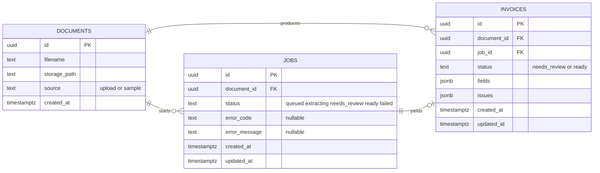

# LedgerParse ER diagram

Postgres schema from `backend/src/schema.sql`.

## Relationships

| From | To | Cardinality | Notes |
| --- | --- | --- | --- |
| `documents` | `jobs` | 1 → N | One PDF can have many extract attempts (including retries). |
| `documents` | `invoices` | 1 → N | Structured results for that file. |
| `jobs` | `invoices` | 1 → 0..1 | A successful job yields one invoice; failed jobs have none. |

Deleting a document cascades to its jobs and invoices (`ON DELETE CASCADE`).

## Indexes

- `jobs_status_idx` on `jobs(status)`
- `invoices_status_idx` on `invoices(status)`
