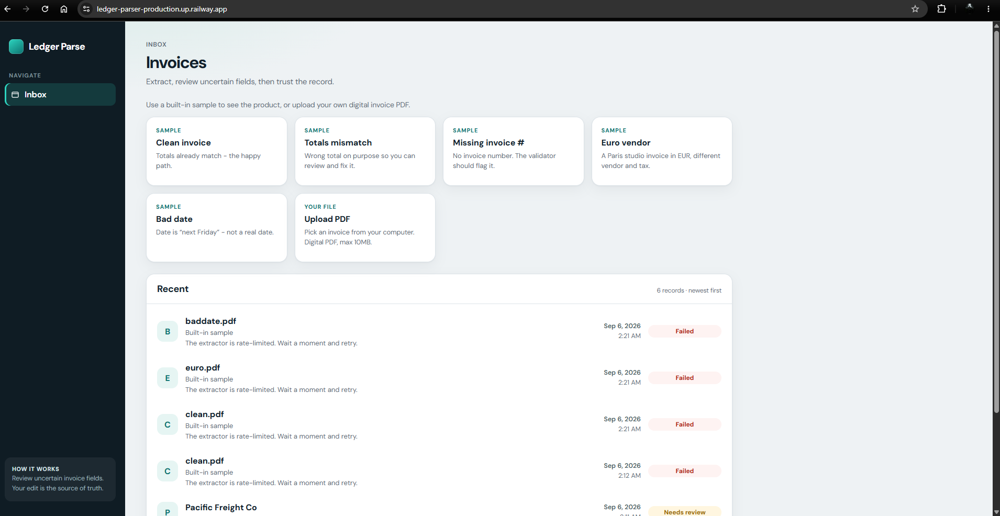
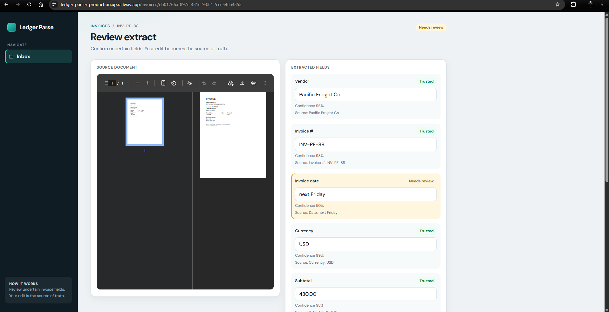

# Ledger Parse

Turn messy vendor invoices into structured data you can review and trust.

Upload a PDF (or try a sample). We pull the text, Gemini fills a fixed schema, a validator flags mismatches, and you confirm or edit. Your edit is the source of truth.

Architecture: [ARCHITECTURE.md](./ARCHITECTURE.md)
Data model: [ERD.md](./ERD.md)

**Live:** [https://ledger-parser-production.up.railway.app/](https://ledger-parser-production.up.railway.app/)

## Screenshots

### Inbox - samples, upload, and Recent



### Review

PDF on the left, trusted fields on the right. Confirm & save when you are happy.



## Local setup

You need Node 20+, Docker, and a free [Gemini API key](https://aistudio.google.com/).

```bash
cp .env.example .env
# put GEMINI_API_KEY in .env
npm install
npm run generate:samples
npm run dev:all
```

App: [http://localhost:5173](http://localhost:5173)  
API: [http://localhost:3001/health](http://localhost:3001/health)

## Scripts

| Command                       | What it does                               |
| ----------------------------- | ------------------------------------------ |
| `npm run dev`                 | Vite + Express                             |
| `npm run dev:all`             | Docker Postgres, then Vite + Express       |
| `npm run dev:down`            | Stop Docker Postgres                       |
| `npm test`                    | Frontend Vitest + backend validator tests  |
| `npm run test:frontend`       | Frontend Vitest                            |
| `npm run test:backend`        | Backend validator + user-edit-wins tests   |
| `npm run lint`                | ESLint (including import order/groups)     |
| `npm run lint:frontend`       | ESLint on `frontend/`                      |
| `npm run lint:backend`        | ESLint on `backend/`                       |
| pre-commit (husky)            | ESLint on staged JS/TS via lint-staged     |
| `npm run typecheck`           | Frontend TypeScript                        |
| `npm run format`              | Prettier                                   |
| `npm run build` / `npm start` | Production: Express serves `frontend/dist` |

## Production (Railway)

One service.

1. Create a GitHub repo and push this project
2. New Railway project from that repo
3. Add a **Postgres** database in the same project, then on the **app** service → Variables → add `DATABASE_URL` as a reference to the Postgres variable (e.g. `${{Postgres.DATABASE_URL}}`). Without this link the start command exits with `DATABASE_URL is required`.
4. Set `GEMINI_API_KEY`, `UPLOAD_DIR=/data/uploads`
5. Mount a volume at `/data/uploads`
6. Build via `nixpacks.toml`: `npm ci --include=dev` then `npm run build` - start: `npm start`  
   (Do not put `npm ci` in Railway’s build command - it double-runs against a locked `node_modules/.cache`.)

This is a single demo workspace (no auth). Anyone with the URL can upload.

## Database: why three tables

Extraction is async and can fail or be retried. One PDF row is not enough - we need the file, the work attempt, and the structured result as separate things.

| Table | What it is | Why it exists |
| --- | --- | --- |
| **`documents`** | The uploaded or sample PDF (filename, path on disk, `upload` vs `sample`) | The file should outlive a failed extract. Retrying must not require uploading again. |
| **`jobs`** | One extract attempt (`queued` → `extracting` → `ready` / `needs_review` / `failed`) | Gemini can time out or return 503. Status, error codes, and retries live here - not mixed into the invoice. |
| **`invoices`** | The structured fields + validator issues after a successful extract | The reviewable record AP cares about. Only created when extract finishes; user edits update this row. |

Flow in one line: **document** (file) → **job** (work) → **invoice** (result). A failed job has no invoice; Retry creates a new attempt on the same document. Diagram: [ERD.md](./ERD.md).

## What to try

1. **Clean** - should land Ready
2. **Totals mismatch** - fix the total to `1284.60` and save
3. **Missing invoice #** / **Bad date** - fields flagged for review
4. **Euro vendor** - different vendor and EUR
5. Upload a non-PDF or a huge file - human error, no stack trace
